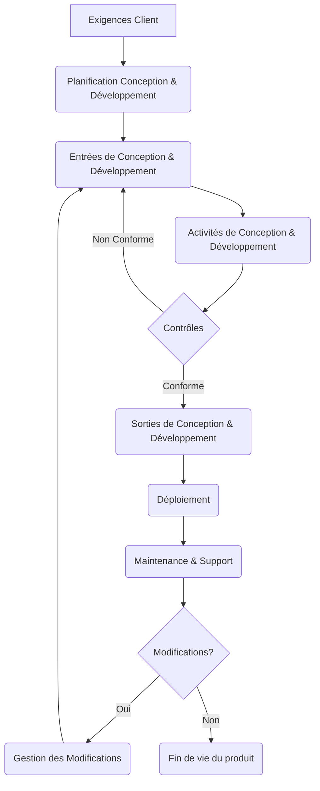

c:\Users\User\Desktop\projet_stage\venv\lib\site-packages\tqdm\auto.py:21: TqdmWarning: IProgress not found. Please update jupyter and ipywidgets. See https://ipywidgets.readthedocs.io/en/stable/user_install.html
  from .autonotebook import tqdm as notebook_tqdm

✅ Chatbot ISO avec mémoire prêt.

--- Menu ---
1. 💬 Mode Chat interactif
2. 📄 Analyse automatique d’un livrable (PDF ou TXT)
Q. ❌ Quitter

❓ Question : ❓ Question : j ai une entreprise de developpement des app mobiles, genere moi un rapport de procedure de conception et dévéloppement, soyez spécifique a mon cas le maximum possible

✅ Réponse :
Absolument ! En tant qu'expert en normalisation ISO 9000 et 9001, je vais vous générer un rapport de procédure de conception et développement spécifiquement adapté à votre entreprise de développement d'applications mobiles, en m'inspirant de la structure et des principes des documents fournis dans le contexte.

---

# Rapport de Procédure : Conception et Développement d'Applications Mobiles

## 1. Introduction

Le présent rapport a pour objet de définir la procédure de conception et de développement des applications mobiles au sein de [Nom de votre entreprise]. L'objectif est de garantir que le processus, depuis la compréhension du besoin client jusqu'au déploiement de l'application, est maîtrisé, efficace et conforme aux exigences des clients et aux normes de qualité applicables.

Cette procédure vise à :
*   Assurer une compréhension claire et complète des besoins et attentes des clients.
*   Planifier et maîtriser les différentes étapes de conception et de développement.
*   Garantir que les éléments de sortie de chaque étape satisfont aux exigences d'entrée correspondantes.
*   Valider que l'application finale répond à l'usage prévu et aux exigences client.
*   Gérer efficacement les modifications tout au long du cycle de vie du projet.

## 2. Documents de Référence

*   **ISO 9001:2015** - Systèmes de management de la qualité — Exigences
*   **ISO 9000:2015** - Systèmes de management de la qualité — Principes essentiels et vocabulaire

## 3. Domaine d'Application

Cette procédure s'applique à l'ensemble des projets de conception et de développement d'applications mobiles réalisés par [Nom de votre entreprise], qu'il s'agisse de nouvelles applications ou de modifications majeures d'applications existantes.

## 4. Termes et Définitions

Conformément à l'ISO 9000:2015 :

*   **Conception et développement (3.7.8)** : Ensemble des processus qui transforment les exigences pour un objet en exigences plus détaillées pour cet objet.
    *   *Note d'expert :* Dans le contexte du développement mobile, cela englobe l'analyse des besoins, la conception UI/UX, l'architecture technique, le codage, les tests et le déploiement.
*   **Exigence (3.6.4)** : Besoin ou attente formulé, généralement implicite ou obligatoire.
    *   *Note d'expert :* Pour une application mobile, cela inclut les exigences fonctionnelles, les exigences de performance, les contraintes techniques (plateforme, OS), les exigences de sécurité, les exigences légales et réglementaires (protection des données, règles des stores d'applications), et les attentes non formulées du client (facilité d'utilisation, esthétique).
*   **Qualité (3.6.2)** : Aptitude d'un ensemble de caractéristiques intrinsèques d'un objet à satisfaire des exigences.
*   **Non-conformité (3.6.9)** : Non-satisfaction d’une exigence.
*   **Processus (3.4.1)** : Ensemble d’activités corrélées ou en interaction qui utilise des éléments d’entrée pour produire un résultat prévu.

**Abréviations spécifiques :**

*   **UI/UX** : User Interface / User Experience
*   **QA** : Quality Assurance (Assurance Qualité)
*   **UAT** : User Acceptance Testing (Tests d'Acceptation par l'Utilisateur)
*   **API** : Application Programming Interface
*   **OS** : Operating System (Système d'exploitation)

## 5. Responsabilités

Les principales responsabilités dans le processus de conception et développement incluent :

*   **La Direction :** Fournit les ressources nécessaires et valide les orientations stratégiques.
*   **Le Chef de Projet :** Planifie, organise, coordonne et suit les activités du projet. Est le point de contact principal avec le client.
*   **L'Analyste Métier / Product Owner :** Recueille, analyse et documente les exigences client.
*   **Le Concepteur UI/UX :** Crée les maquettes, prototypes et spécifications d'interface utilisateur et d'expérience utilisateur.
*   **Les Développeurs (Frontend/Backend) :** Conçoivent l'architecture technique et écrivent le code source de l'application.
*   **Les Testeurs QA :** Planifient, exécutent les tests et rapportent les anomalies.
*   **Le Spécialiste Déploiement :** Gère le processus de soumission et de mise à jour sur les stores d'applications.

## 6. Détails de la Procédure (Description des Activités)

Le processus de conception et développement est structuré en plusieurs étapes clés, conformément aux exigences de l'ISO 9001:2015, article 8.3.

### 6.1 Logigramme du Processus

Voici une représentation schématique du processus :

### 6.2 Description des Étapes

| Étape                                   | Responsable(s) Clé(s)      | Activités Clés                                                                                                                               | Entrées                                                                 | Sorties (Informations Documentées)                                                                 | Contrôles                                                                                                |
| :-------------------------------------- | :------------------------- | :------------------------------------------------------------------------------------------------------------------------------------------- | :---------------------------------------------------------------------- | :------------------------------------------------------------------------------------------------- | :------------------------------------------------------------------------------------------------------- |
| **1. Planification** (ISO 9001:2015, 8.3.2) | Chef de Projet, Direction | - Définir les étapes du projet.  - Identifier les ressources nécessaires (humaines, matérielles, logicielles).  - Établir le planning.  - Définir les responsabilités.  - Planifier les revues, vérifications et validations. | Proposition commerciale validée, Contrat client                         | Plan de projet (étapes, ressources, planning), Matrice des responsabilités                             | Revue par la Direction, Validation du plan de projet                                                     |
| **2. Entrées** (ISO 9001:2015, 8.3.3)   | Analyste Métier, Chef de Projet | - Recueillir les besoins client (ateliers, entretiens).  - Analyser les exigences (fonctionnelles, techniques, réglementaires, etc.).  - Documenter les exigences de manière claire et non ambiguë.  - Résoudre les exigences conflictuelles. | Besoins bruts client, Exigences légales/réglementaires, Spécifications techniques, Informations projets antérieurs | Document de spécifications des exigences (fonctionnelles, non fonctionnelles), Cas d'utilisation         | Revue des exigences avec le client, Validation interne de la complétude et clarté des exigences           |
| **3. Activités de Conception & Développement** | UI/UX Designer, Développeurs | - Concevoir l'architecture technique.  - Créer les maquettes et prototypes UI/UX.  - Développer le code source.  - Intégrer les APIs et services tiers.  - Réaliser les tests unitaires et d'intégration. | Document de spécifications des exigences, Contraintes techniques/plateformes, Standards de développement | Architecture technique, Maquettes UI/UX, Code source, Documentation technique                          | Revues de conception (architecture, UI/UX), Revues de code, Tests unitaires, Tests d'intégration           |
| **4. Contrôles** (ISO 9001:2015, 8.3.4) | Chef de Projet, QA Testers, Client | - Réaliser les tests système (fonctionnels, performance, sécurité).  - Mener des revues de conception et de développement.  - Réaliser les UAT avec le client.  - Identifier et traiter les non-conformités (bugs). | Code source, Maquettes UI/UX, Environnement de test, Cas de test, Critères d'acceptation           | Rapports de tests (système, UAT), Liste des anomalies (bugs), Fiches de non-conformité, Plan d'actions correctives | Suivi des indicateurs de qualité (nombre de bugs par fonctionnalité, taux de réussite des tests), Validation client des UAT |
| **5. Sorties** (ISO 9001:2015, 8.3.5)   | Chef de Projet, Spécialiste Déploiement | - Consolider les éléments de sortie validés.  - Préparer le package de déploiement.  - Rédiger la documentation utilisateur/technique finale.  - S'assurer que les sorties répondent aux exigences d'entrée et sont prêtes pour le déploiement. | Code source final validé, Rapports de tests validés, Documentation technique/utilisateur, Critères d'acceptation finaux | Package de déploiement (IPA/APK), Documentation utilisateur/technique, Attestation de conformité interne | Validation finale des éléments de sortie par le Chef de Projet et/ou la Direction                       |
| **6. Déploiement** (ISO 9001:2015, 8.5.1 h) | Spécialiste Déploiement | - Soumettre l'application aux stores (Apple App Store, Google Play Store).  - Gérer le processus d'approbation.  - Mettre l'application à disposition des utilisateurs. | Package de déploiement, Informations du store (métadonnées, captures d'écran), Politiques des stores | Application publiée sur les stores, Confirmation de publication                                        | Conformité aux règles des stores, Suivi du statut de publication                                         |
| **7. Maintenance & Support** (ISO 9001:2015, 8.5.1 h) | Développeurs, Support Technique | - Fournir un support aux utilisateurs.  - Identifier et corriger les anomalies post-lancement.  - Planifier et réaliser les mises à jour (correctives, évolutives). | Retours utilisateurs, Rapports d'erreurs, Exigences de modifications | Mises à jour (nouvelles versions), Documentation de version, Rapports d'incidents résolus             | Suivi des incidents, Taux de résolution, Satisfaction client (support)                                 |
| **8. Gestion des Modifications** (ISO 9001:2015, 8.3.6) | Chef de Projet, Équipe Projet | - Identifier les demandes de modification (client, interne, réglementaire).  - Analyser l'impact des modifications (coût, délai, technique).  - Réaliser une revue des modifications proposées.  - Autoriser ou rejeter les modifications.  - Mettre en œuvre les modifications approuvées en reprenant les étapes nécessaires (planification, conception, dev, test...). | Demande de modification, Impact analysis, Plan de projet actuel | Enregistrement des modifications, Résultats des revues de modification, Autorisation des modifications, Plan de mise en œuvre des modifications | Revue et validation par le Chef de Projet et le client (si impact majeur), Suivi de l'impact réel sur le projet |

## 7. Informations Documentées à Conserver

Conformément à l'ISO 9001:2015, les informations documentées suivantes doivent être conservées :

*   Plan de projet ([ENR_DEV_01])
*   Document de spécifications des exigences ([ENR_DEV_02])
*   Spécifications techniques et d'architecture ([ENR_DEV_03])
*   Maquettes et prototypes UI/UX ([ENR_DEV_04])
*   Code source (dans un système de gestion de versions) ([ENR_DEV_05])
*   Plans de test et cas de test ([ENR_DEV_06])
*   Rapports de tests (unitaires, intégration, système, UAT) ([ENR_DEV_07])
*   Liste des anomalies (bugs) et leur statut ([ENR_DEV_08])
*   Compte rendu des revues de conception et développement ([ENR_DEV_09])
*   Enregistrement des modifications de conception et développement (demande, analyse, autorisation) ([ENR_DEV_10])
*   Documentation utilisateur et technique ([ENR_DEV_11])
*   Logs de déploiement ([ENR_DEV_12])
*   Retours clients et incidents de support ([ENR_DEV_13])

*Note : Les références entre crochets ([ENR_DEV_xx]) sont des exemples de codification que vous pourriez utiliser dans votre propre système de management.*

## 8. Indicateurs de Performance

Le processus de conception et développement peut être suivi à l'aide d'indicateurs tels que :

*   **Taux de conformité des exigences :** Nombre d'exigences client validées / Nombre total d'exigences initiales.
*   **Pourcentage de couverture des tests :** Nombre de cas de test exécutés / Nombre total de cas de test.
*   **Nombre d'anomalies (bugs) :** Suivi par phase (développement, QA, UAT, post-déploiement) et par criticité.
*   **Taux de respect du planning :** Jours de retard / Jours planifiés.
*   **Taux de respect du budget :** Écart budgétaire / Budget initial.
*   **Taux de satisfaction client (phase UAT et post-déploiement) :** Mesuré par enquêtes ou retours directs.

Ces indicateurs doivent être mesurés, analysés et présentés lors des revues de projet et de la Revue de Direction pour identifier les opportunités d'amélioration.

## 9. Amélioration Continue

L'amélioration du processus de conception et développement est essentielle. Elle s'appuie sur :

*   L'analyse des indicateurs de performance.
*   L'analyse des non-conformités (bugs, retards, écarts budgétaires) et la mise en œuvre d'actions correctives (conformément à votre procédure de gestion des non-conformités).
*   Les retours d'expérience des équipes projet et des clients.
*   Les revues de projet régulières.
*   La Revue de Direction.

---

Ce rapport fournit un cadre structuré pour votre procédure de conception et développement, en l'alignant sur les exigences de l'ISO 9001:2015 et en l'adaptant à votre secteur d'activité. N'hésitez pas à détailler davantage chaque étape et à créer les documents (ENR, PRD, INST) correspondants selon votre organisation interne.

--- Menu ---
1. 💬 Mode Chat interactif
2. 📄 Analyse automatique d’un livrable (PDF ou TXT)
Q. ❌ Quitter
👋 Au revoir !
